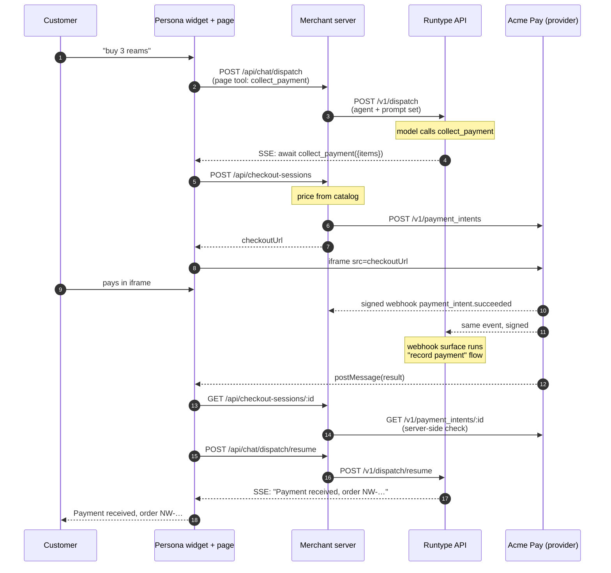
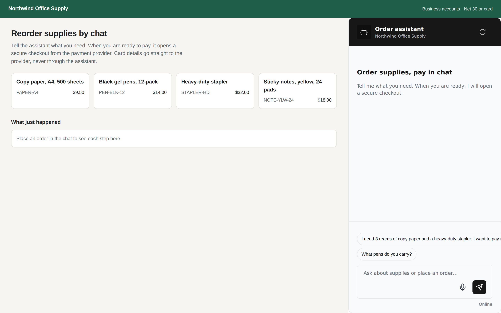
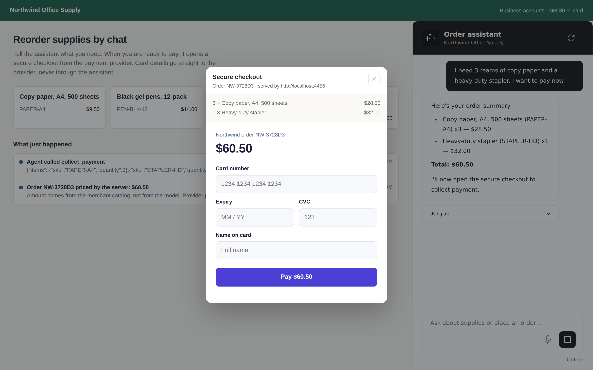
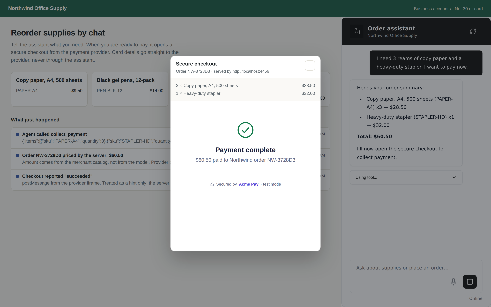
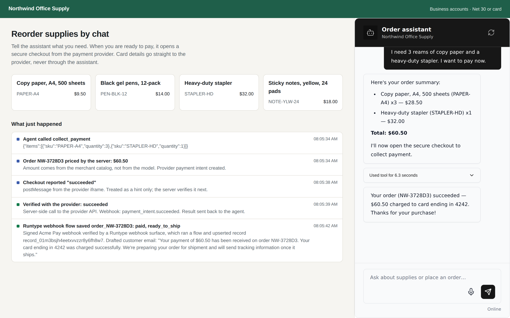
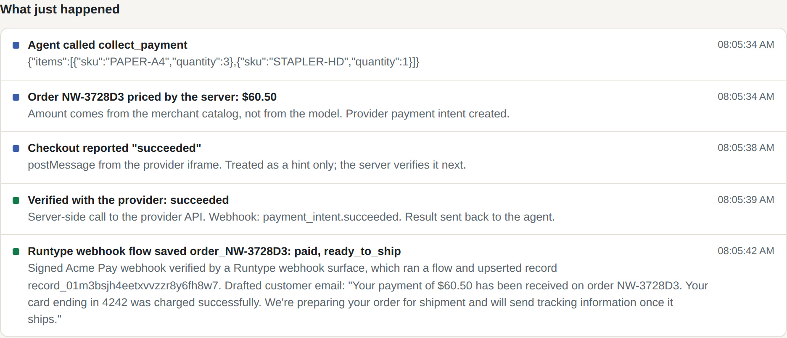
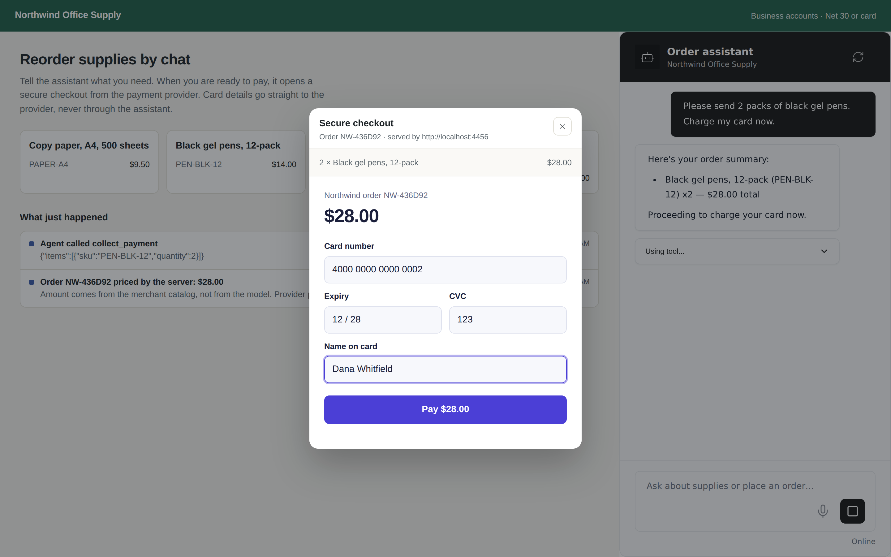
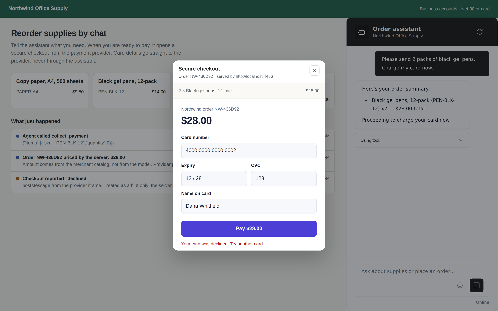
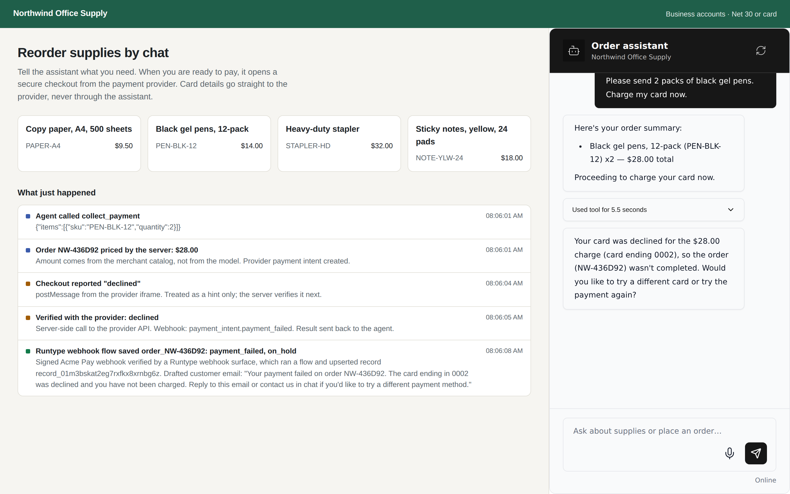
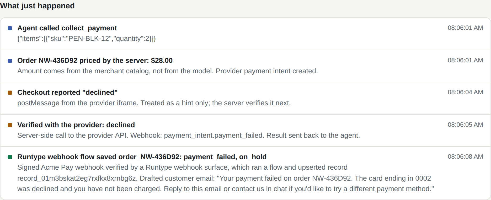

# persona-collect-payment: take a payment inside a Runtype chat

A Runtype agent sells office supplies in a Persona chat widget. When the customer
is ready to pay, the agent calls a `collect_payment` tool. The page opens the
payment provider's own hosted checkout in an iframe, the customer pays there, and
the agent picks the conversation back up with a verified result.

Card details never touch the agent, the model, or Runtype. The agent only ever
sees an order number, a payment id, a status, and the last four digits of the card.

The payment provider here is **Acme Pay**, a mock provider. It has
Stripe-shaped payment intents, a hosted checkout page, and signed webhooks, and
it runs locally on a second origin so the iframe is genuinely cross-origin.
Replace it with the real provider's SDK to productionize.

## Sequence



## What each piece shows

| Concern                           | Where                                                                                                                                                      | Why it matters to a payment provider                                                                                                  |
| --------------------------------- | ---------------------------------------------------------------------------------------------------------------------------------------------------------- | ------------------------------------------------------------------------------------------------------------------------------------- |
| Agent can pause for the browser   | `public/app.js` registers `collect_payment` as a WebMCP page tool; Persona sends it to Runtype as a client tool and resumes the run with the tool's result | This is the hook a provider's drop-in checkout plugs into. No Runtype changes needed.                                                 |
| Card data stays with the provider | `provider/checkout.html` is served from the provider's origin inside an iframe; the card form never exists in the merchant page                            | The merchant and Runtype stay out of PCI scope for card entry.                                                                        |
| The model cannot set the price    | `server.mjs` prices the order from the server-side catalog (`priceItemsFromCatalog`); the agent only passes SKUs and quantities                            | A prompt-injected or confused agent cannot change the amount charged.                                                                 |
| The browser is not trusted        | The iframe's `postMessage` only says "done". The page asks the merchant server, which asks the provider's API, before telling the agent                    | A spoofed "payment succeeded" message does not turn into a confirmed order.                                                           |
| Server-side confirmation          | The provider sends every payment event, signed, to each registered webhook endpoint: the merchant server and a Runtype webhook surface                     | The event reaches the business even when the customer's tab is gone. See [The Runtype webhook surface](#the-runtype-webhook-surface). |

## The Runtype webhook surface

The chat and the webhook do different jobs, and a real deployment uses both:

- **The chat path** (iframe, server-side check, resume) tells the agent the result
  while the customer is still in the conversation.
- **The webhook** is the durable record. It arrives even when the customer closes
  the tab right after paying, and it is the only signal for payments that settle
  later (bank debits, 3-D Secure completed after the checkout closed, refunds,
  disputes).

`npm run setup:runtype` creates this in your Runtype account:

1. A flow, **Northwind: record Acme Pay payment**, that normalizes the event,
   has a model draft the customer email, and upserts one `northwind_orders`
   record per order (`order_<orderId>`), so a retry or a later event updates the
   same record instead of adding another.
2. A product, **Northwind payments**, with that flow as its capability.
3. A **webhook surface** with signature verification on (`signingConfig.provider:
"standard-webhooks"` plus an inbound secret). A request with a missing or wrong
   signature is rejected with `401 INVALID_SIGNATURE` before anything runs. A
   valid one answers `202` and runs the flow asynchronously. Runtype uses the
   `webhook-id` header as the event id for deduplication.

It writes the webhook URL and the signing secret to `runtype-webhook.local.json`
(gitignored). `server.mjs` reads that file and registers Runtype as a second
webhook endpoint on the mock provider. Without the file the demo still runs, with
the merchant server as the only endpoint.

Acme Pay signs with [Standard Webhooks](https://www.standardwebhooks.com/)
(`webhook-id`, `webhook-timestamp`, `webhook-signature: v1,<base64 HMAC>`), one
secret per endpoint. A payment provider that signs this way, or the way Stripe
does, can deliver to any Runtype webhook surface with no custom code on the
Runtype side. After the payment, the page reads the order record back from the
Runtype records API and shows it in "What just happened".

## Run it

Needs Node 20+ and a Runtype API key.

```bash
npm install
export RUNTYPE_API_KEY=...               # RUNTYPE_API_URL defaults to https://api.runtype.com
npm run setup:runtype                    # once: creates the flow, product and webhook surface
npm start
open http://localhost:4455
```

The Runtype webhook URL must be reachable from wherever the provider runs. Here
the mock provider runs locally and posts to the hosted Runtype API, so no tunnel
is needed.

Try "I need 3 reams of copy paper and a stapler, and I want to pay now". In the checkout:

- `4242 4242 4242 4242` succeeds.
- Any other card number is declined, so you can see the agent handle a failure.
- Closing the checkout window tells the agent the customer backed out.

## Why the checkout opens from `onConfirm`, not from the tool's `execute()`

Persona gives every WebMCP tool's `execute()` a fixed 30-second budget
(`DEFAULT_TOOL_TIMEOUT_MS` in Persona's `webmcp-runtime-entry.ts`), which is not
enough for a person to type a card number. The confirm gate that runs before
`execute()` has no timeout, and it is the documented hook for a custom confirmer.
A money-moving tool needs one anyway, so the demo puts the checkout there:

1. `webmcp.onConfirm` opens the provider's checkout and resolves when the
   customer pays, is declined, or closes the window (`false`, which tells the
   agent "User declined the tool call.").
2. `execute()` then only does the fast part: it checks the result with the
   merchant server and returns it to the agent.

A per-tool timeout in Persona would let this collapse into `execute()`.

## Files

- `server.mjs` starts both servers with no dependencies beyond Node: the merchant
  site on `:4455` (page, Persona assets, Runtype proxy, checkout API, webhook
  receiver, Runtype order-record lookup) and the mock provider on `:4456`.
- `setup-runtype.mjs` creates the Runtype flow, product and signed webhook surface.
- `public/` is the merchant page and widget setup.
- `provider/checkout.html` is the provider's hosted checkout.
- `screenshots/` shows a recorded run of both scenarios.

## Screenshots

Recorded with `claude-sonnet-5`.

Successful payment:

|                                                                         |                                                                                                 |
| ----------------------------------------------------------------------- | ----------------------------------------------------------------------------------------------- |
|                                       |  |
|  |                |
|  |                |

Declined card:

|                                                                                              |                                                                                                     |
| -------------------------------------------------------------------------------------------- | --------------------------------------------------------------------------------------------------- |
|                            |                             |
|  |  |
